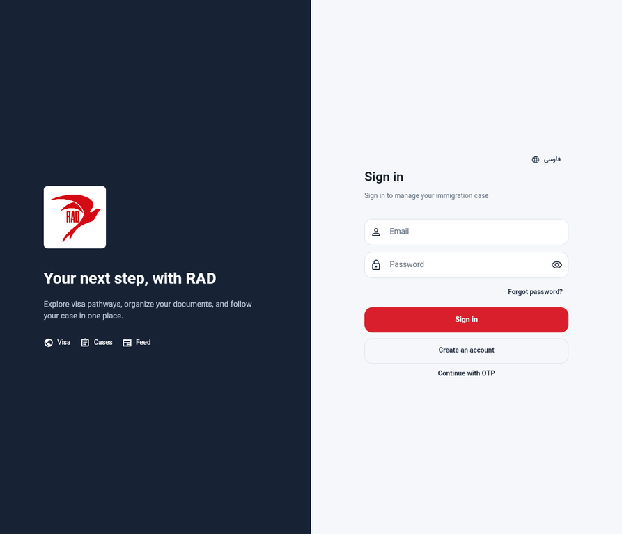

# Premium Motion, VFX & UI/UX Delivery Report

**Branch:** `feature/premium-motion-vfx-uiux`
**Base:** current `main` head (`0982926`)
**Delivery state:** implementation complete; not merged and not deployed.

## Scope and safety boundary

This change upgrades presentation and interaction layers only. It does not modify Supabase schema, database data, RLS, Auth configuration, Render configuration, deployment settings, credentials, migrations, or authentication providers/token handling. The recent password-recovery hotfixes were retained untouched. Authentication screens received shared visual-component improvements only; login, registration, OTP, forgot-password, and password-reset behavior remains unchanged.

## Reference research and original RAD direction

Live Bixa observations and the original RAD interpretation are documented in [BIXA Reference Research](BIXA_REFERENCE_RESEARCH.md). The implementation is not a copy: it retains RAD’s owner-supplied logo and authoritative red primary action colour, then introduces a restrained midnight-navy, teal, and cyan treatment for depth, focus, and active-progress states.

## Motion design system

| Layer | Delivered behavior |
|---|---|
| Tokens | `AppMotion` centralizes button, hover, modal, card entrance, page, progress, stagger, and ambient durations; a shared expressive ease-out curve; bounded stagger delays; and RTL-aware directional offsets. |
| Reduced motion | Every reusable primitive checks `MediaQuery.disableAnimations`; entrances render immediately, durations become zero, and ambient animation stops. |
| Entrance and stagger | `MotionReveal` and `MotionStagger` provide semantic-safe fade, translate, and scale reveals without delaying data or navigation. |
| Interactive surfaces | `AppCard` adds keyboard focus, pointer hover, press-scale feedback, border emphasis, and a touch-safe InkWell path. `SectionCard` now inherits it. |
| Inputs and actions | `AppTextField` animates an accessible focus halo; `AppButton` centralizes button feedback and loading-content swaps. |
| Progress and loading | `ProgressSteps` animates only supplied status changes; `MotionCount` only animates verified metric values; `LoadingState` includes static semantic skeleton surfaces instead of a perpetual shimmer. |
| Premium VFX | `AmbientBackdrop` provides a low-cost, repaint-bounded radial depth treatment. It moves only during splash or an active AI request, and is static for reduced-motion users. |

## Updated product surfaces

| Surface | Delivered refinement |
|---|---|
| Splash | Ambient midnight/teal/red depth, logo reveal, and a non-blocking loading state. Bootstrap and auth routing start immediately and never wait for animation. |
| Login, registration, OTP, recovery, reset | Shared field focus transitions, action feedback, loading swaps, readable live-region errors, and preserved input behavior. |
| App shell | Consistent route entrance and modal-sheet timing. |
| Dashboard | Staggered KPI surfaces and value animation only after real application/document data arrives. |
| Visa discovery | Staggered, interactive program cards; existing source/disclaimer and data-display rules are unchanged. |
| Applications | Staggered application cards plus connected timeline nodes, glow, and text treatment that transition only between verified backend statuses. |
| Documents | Staggered document cards and a visible indeterminate activity indicator only while the real upload request is in progress. No completion is shown until the existing upload call succeeds. |
| Consultation | Carded, focus-aware fields, real submit loading state, and staggered existing consultation cards. |
| AI assistant | Ambient depth is active only while a request is actually pending; conversation rows reveal in sequence. No idle processing state is implied. |
| Feed and notifications | Staggered interactive cards, preserving existing mark-read and bookmark actions. |
| Profile | Animated edit/summary transition and shared focus/action feedback. |
| Admin hub | Restrained staggered operational navigation cards; no persistent cinematic effects were added to data-dense administrative tables or controls. |

## Accessibility and responsive safeguards

- System reduced motion is honored in every new primitive.
- Essential content remains in the semantics tree while entering; the regression suite verifies the splash brand label immediately.
- Interactive cards retain Material ink, keyboard focus, semantic button roles, and touch activation; hover is additive rather than required.
- Existing RTL directionality remains application-controlled. The motion system exposes an RTL-aware directional helper and introduces no physical left/right navigation arrows.
- No flash effects, essential timing dependencies, artificial success state, or synthetic statistics were added.

## Visual QA evidence

No production data or authenticated account was used. The comparison captures the unauthenticated desktop login screen.

| Baseline | Local implementation build |
|---|---|
|  |  |

The visual refinements are intentionally interaction-led (focus, hover, press, entrance, and reduced-motion alternatives), so a still login frame is deliberately close to the baseline while preserving professional readability.

## Measured verification

| Check | Actual result |
|---|---|
| `dart format lib test` | Passed with no pending formatting changes. |
| `flutter analyze` | Passed: **No issues found**. |
| Focused motion + app boot tests | Passed: **4 tests**. |
| Full Flutter suite | Passed: **197 tests**. |
| Web build | Passed with configured non-production Supabase defines. The final build completed in **86 seconds** and produced a **43 MB** `build/web` directory in this sandbox. Flutter reported existing WebAssembly dry-run incompatibilities in `flutter_secure_storage_web`; the JavaScript web build succeeded. |
| Android debug build (arm64) | Passed with Flutter 3.47.6, Android SDK 36, and Java 17. Artifact: `build/app/outputs/flutter-apk/app-debug.apk` (**90 MB**). Flutter emitted an existing forward-compatibility warning for the `file_picker` Kotlin Gradle Plugin integration; the debug APK succeeded. |
| Diff validation | `git diff --check` passed. No Auth, Supabase, migration, Render, or deployment files changed. |

### Performance note

This environment supports compile/package verification but has no physical Android device or Chrome profiling target. Therefore, the report does **not** claim measured UI/raster frame timing or 60-FPS results. The implementation constrains continuous animation to splash and an active AI request, uses a `RepaintBoundary` for ambient layers, avoids shaders/blur/particles, bounds stagger delay, uses static skeletons, and disposes controllers/timers. Device-profile frame timing remains a release-gate follow-up.

## Known limitations and follow-up

1. Authenticated dashboard, document, application, consultation, and admin visual captures were not taken to avoid accessing or exposing customer data. Their code paths are covered by static analysis and the full automated suite.
2. Physical-device frame timing, raster metrics, and GPU profiling require a controlled device/profile-mode test pass.
3. The baseline web dependency currently prevents a WebAssembly build dry run (`flutter_secure_storage_web` uses unsupported web libraries); the standard JavaScript web build is successful.
4. Flutter warns that the installed `file_picker` plugin still applies the Kotlin Gradle Plugin; this is a future Flutter compatibility concern outside this UI-only scope.

## Rollback

1. Do not merge the PR if visual changes are not desired.
2. After merge, revert the dedicated commits in reverse order using `git revert <commit>`; no database or infrastructure rollback is required.
3. Re-run `flutter analyze`, `flutter test`, web build, and Android debug build after the revert.

## Deployment state

No branch was merged, no production data was touched, and no Render/Supabase deployment action was performed.
